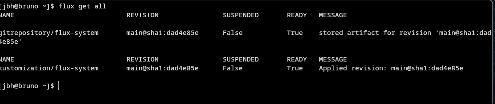

# Raspberry Pi k3s GitOps Cluster with FluxCD

## Overview

This repository contains the GitOps configuration for my Raspberry Pi Kubernetes (k3s) cluster.

The cluster is managed using **FluxCD**, which continuously synchronizes the Kubernetes cluster with this Git repository. Instead of manually deploying resources with `kubectl apply`, cluster configuration is stored in Git and automatically reconciled by Flux.

---
## Project Status

✅ FluxCD successfully bootstrapped

✅ GitHub repository synchronized

✅ GitOps reconciliation working

🔄 Next: Deploy workloads using GitOps
---
## Objectives

- Learn GitOps principles
- Deploy Kubernetes workloads using FluxCD
- Manage infrastructure as code
- Build hands-on Platform Engineering skills
- Create a production-style Kubernetes homelab

---

## Environment

| Component | Technology |
|-----------|------------|
| Kubernetes | k3s |
| Hardware | Raspberry Pi |
| GitOps | FluxCD |
| Source Control | GitHub |
| Operating System | Ubuntu Server |
| Administration Workstation | Arch Linux + Hyprland |

---

## Repository Structure

```text
pi-cluster/
└── clusters/
    └── staging/
        └── flux-system/
            ├── gotk-components.yaml
            ├── gotk-sync.yaml
            └── kustomization.yaml
```

---

## Flux Status

Verify GitOps synchronization:

```bash
flux get all
```

Verify Flux controllers:

```bash
kubectl get pods -n flux-system
```

Expected controllers:

- source-controller
- kustomize-controller
- helm-controller
- notification-controller

---

## Architecture

```text
            GitHub Repository
                    │
             git push / commit
                    │
                    ▼
              Flux Source Controller
                    │
                    ▼
           Kustomize Controller
                    │
                    ▼
        Raspberry Pi k3s Cluster
```

---

## Skills Demonstrated

- Kubernetes (k3s)
- GitOps
- FluxCD
- Git & GitHub
- Linux Administration
- Infrastructure as Code
- Kubernetes troubleshooting
- DNS troubleshooting
- Platform Engineering fundamentals

---

## Lessons Learned

During the initial Flux bootstrap, synchronization failed because Kubernetes DNS was forwarding requests to an outdated DNS server after the Raspberry Pi was moved to a new network.

Troubleshooting included:

- Verifying Flux controllers
- Testing DNS resolution from inside the cluster
- Reviewing CoreDNS logs
- Restarting CoreDNS to refresh its upstream DNS configuration

After resolving the DNS issue, Flux successfully synchronized the cluster with GitHub.

---

## Future Enhancements

- Deploy applications using GitOps
- Manage Helm releases with Flux
- Implement Sealed Secrets
- Add monitoring with Prometheus and Grafana
- Configure automated image updates
## Screenshot

### FluxCD successfully synchronized with GitHub

The screenshot below shows the Flux GitRepository and Kustomization resources in the **Ready** state, along with all Flux controllers running in the `flux-system` namespace.


